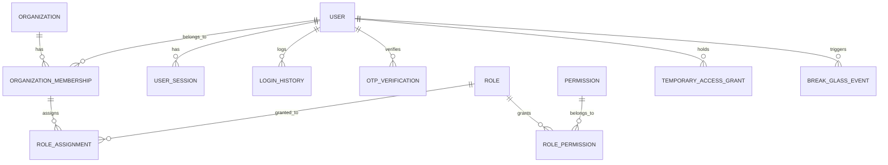
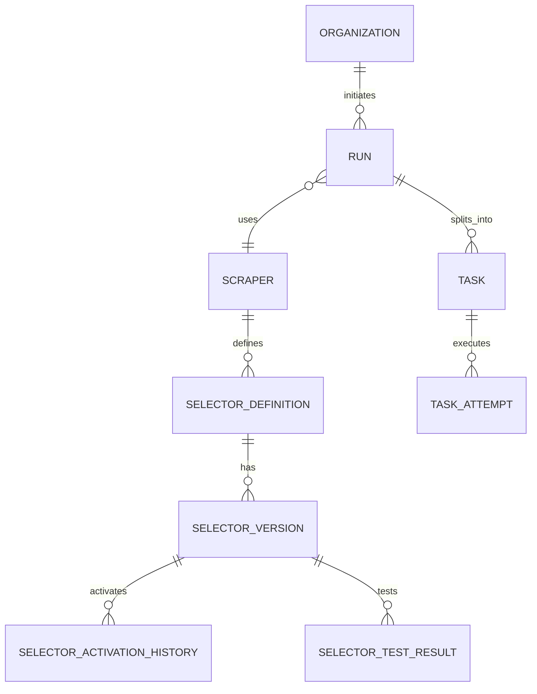
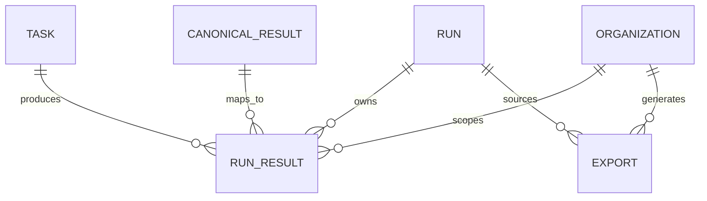
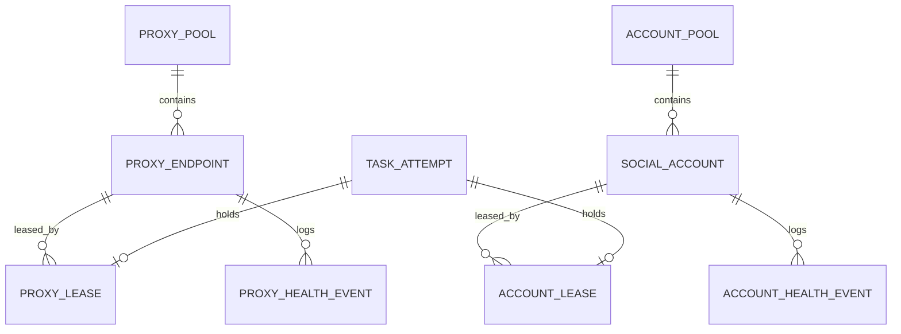
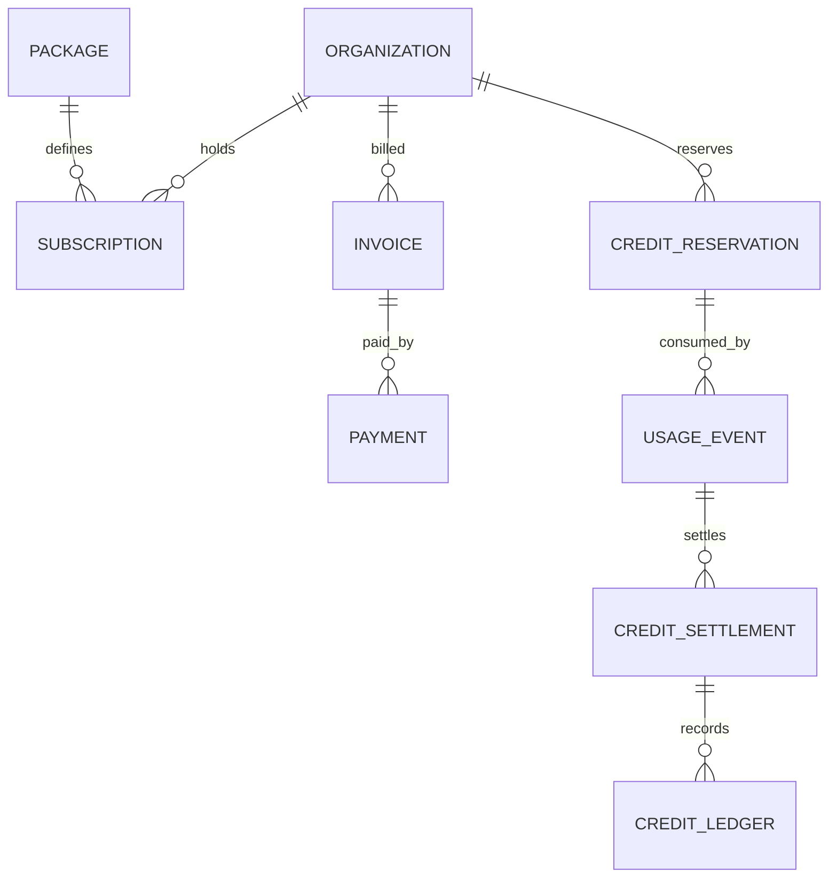
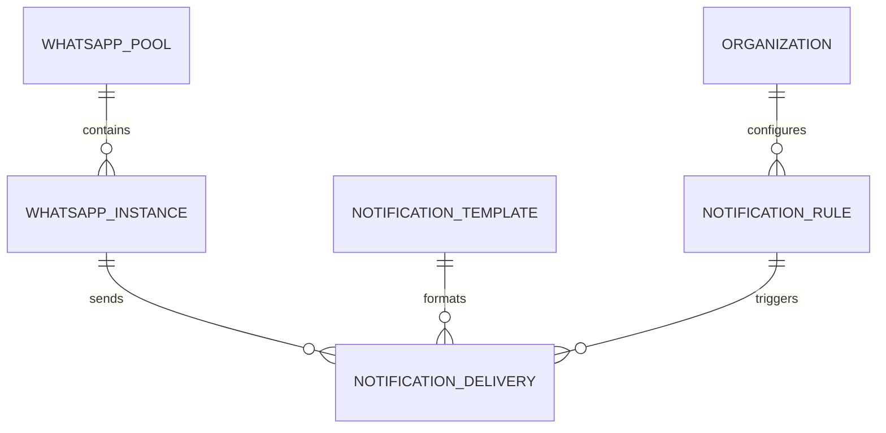
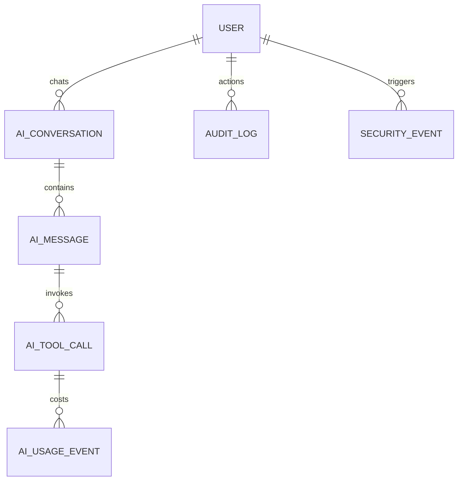

# DATABASE ARCHITECTURE (ERD & SCHEMA)

This document serves as the authoritative, logical PostgreSQL data architecture for the Scraping as a Service platform.

## 1. DESIGN PRINCIPLES
- **Database Engine**: PostgreSQL (Durable Source of Truth).
- **Queue/Runtime**: Redis is used for ephemeral states (e.g. queue order, temporary fast-locks, rate limits), but PostgreSQL is the durable ledger.
- **Multi-tenancy**: Strict isolation via `organization_id` on all tenant-owned resources.
- **Canonical Boundary**: `canonical_results` strictly decouples globally deduplicated scraping payload from tenant-owned `run_results`.
- **Soft vs Hard Deletes**: Critical business records (Organizations, Users, Billing) use soft deletes. Massive logs and canonical records use hard deletes/partition dropping based on retention rules.
- **Timestamps**: Explicit `created_at` and `updated_at` (timezone-aware `timestamptz`).
- **Enums**: System statuses are uppercase strings (e.g., `QUEUED`, `RUNNING`).

---

## 2. DATABASE DOMAIN INVENTORY

1. **IAM & Authentication**: Users, Sessions, Login History, OTP Rules.
2. **Organizations**: Organizations, Memberships.
3. **RBAC**: Roles, Permissions, Assignments, Elevate/Break-glass.
4. **API & Webhooks**: Keys, Endpoints, Deliveries.
5. **Scraper Catalog & Selectors**: Scrapers, Selector Versions, Activation History.
6. **Execution**: Runs, Tasks, Task Attempts.
7. **Canonical Data**: Canonical Results, Run Results.
8. **Exports**: Export Files, Metadata.
9. **Resources**: Proxy Pools, Social Account Pools, Leases.
10. **Billing & Finance**: Packages, Subscriptions, Invoices, Reservations, Usage, Settlement, Ledger.
11. **Notifications**: Templates, Rules, Deliveries (WhatsApp, Telegram, Email).
12. **AI**: Conversations, Messages, Tool Calls, Audits.
13. **Operations**: Incidents, Fingerprints, Maintenance.
14. **Security & Audit**: Audit Logs, Security Events.
15. **System Settings**: Branding, Provider Configurations.

---

## 3. DOMAIN ERD DIAGRAMS

### 3.1. IAM, Organization & RBAC

### 3.2. Scraping Engine & Execution

### 3.3. Canonical Data Boundary

### 3.4. Resources & Leases

### 3.5. Billing Lifecycle

### 3.6. Notifications & WhatsApp

### 3.7. Internal AI & Audit

---

## 4. TABLE SPECIFICATIONS

### 4.1. IAM / Authentication
**`users`**
- **Purpose**: Core identity for all humans.
- **PK**: `id` (UUID)
- **Columns**: `email` (VARCHAR), `password_hash` (VARCHAR), `full_name` (VARCHAR), `mfa_enabled` (BOOLEAN), `mfa_secret` (VARCHAR, Encrypted), `status` (VARCHAR: ACTIVE, SUSPENDED), `last_login_at` (TIMESTAMPTZ)
- **Security**: Password Hash (Bcrypt/Argon2), MFA Secret (Reversible Encrypted).
- **Retention**: Soft delete (`deleted_at`).

**`user_sessions`**
- **Purpose**: Manage active login sessions/devices.
- **PK**: `id` (UUID)
- **Columns**: `user_id` (FK), `device_identifier` (VARCHAR), `ip_address` (VARCHAR), `expires_at` (TIMESTAMPTZ), `revoked_at` (TIMESTAMPTZ)
- **Retention**: Hard delete 30 days after expiration.

**`otp_verifications`**
- **Purpose**: Short-lived OTP tracking (Email, WhatsApp, Telegram, Password Reset).
- **PK**: `id` (UUID)
- **Columns**: `user_id` (FK, Nullable), `channel` (VARCHAR: EMAIL, WHATSAPP, TELEGRAM), `target_address` (VARCHAR), `otp_hash` (VARCHAR), `expires_at` (TIMESTAMPTZ), `used_at` (TIMESTAMPTZ)
- **Security**: OTP code is **HASH ONLY**, never plaintext.
- **Retention**: Hard delete 7 days after expiry.

**`organizations`**
- **Purpose**: Multi-tenant billing boundary.
- **PK**: `id` (UUID)
- **Columns**: `name` (VARCHAR), `billing_email` (VARCHAR), `status` (VARCHAR: ACTIVE, SUSPENDED, CHURNED).
- **Retention**: Soft delete.

**`organization_memberships`**
- **Purpose**: Map users to tenants.
- **PK**: `id` (UUID)
- **Columns**: `user_id` (FK), `organization_id` (FK), `status` (VARCHAR: INVITED, ACTIVE, DISABLED).
- **Indexes**: Unique `(user_id, organization_id)`.

### 4.2. RBAC
**`roles`**
- **Purpose**: Defines a role template.
- **PK**: `id` (UUID)
- **Columns**: `name` (VARCHAR), `scope` (VARCHAR: CUSTOMER_ORGANIZATION, INTERNAL_PLATFORM).

**`permissions`**
- **Purpose**: Atomic capability (e.g. `run:create`, `billing:view`).
- **PK**: `id` (UUID)
- **Columns**: `name` (VARCHAR), `scope` (VARCHAR).

**`role_permissions`**
- **Purpose**: M2M Role to Permission.
- **PK**: `role_id`, `permission_id`

**`role_assignments`**
- **Purpose**: Grants a role to a user within a specific scope.
- **PK**: `id` (UUID)
- **Columns**: `user_id` (FK), `role_id` (FK), `organization_id` (FK, Nullable for Internal scope).

**`temporary_access_grants` & `break_glass_events`**
- **Purpose**: Track elevated / emergency access.
- **Columns**: `user_id`, `role_id`, `reason` (TEXT), `granted_at`, `expires_at`, `revoked_at`, `approved_by` (FK).

### 4.3. API & Webhooks
**`api_keys`**
- **Purpose**: Developer API access.
- **PK**: `id` (UUID)
- **Columns**: `organization_id` (FK), `name` (VARCHAR), `key_hash` (VARCHAR), `key_prefix` (VARCHAR), `expires_at` (TIMESTAMPTZ), `last_used_at` (TIMESTAMPTZ).
- **Security**: HASH ONLY.
- **Indexes**: Unique `key_hash`.

**`webhook_endpoints`**
- **Purpose**: Customer event destinations.
- **PK**: `id` (UUID)
- **Columns**: `organization_id` (FK), `url` (VARCHAR), `signing_secret` (VARCHAR, Encrypted), `is_active` (BOOLEAN).
- **Security**: Reversible Encryption for signing secret.

**`webhook_delivery_attempts`**
- **Purpose**: Track delivery lifecycle.
- **Columns**: `endpoint_id` (FK), `event_type`, `payload` (JSONB), `status` (QUEUED, SENDING, DELIVERED, FAILED), `http_status`, `response_body`, `attempt_count`.
- **Retention**: Partitioned by date, hard drop after 30 days.

### 4.4. Scraper Catalog & Selectors
**`scrapers`**
- **Purpose**: High-level capability definition.
- **PK**: `id` (UUID)
- **Columns**: `name` (VARCHAR), `target_platform` (VARCHAR: INSTAGRAM, X, WEB), `base_cost_per_task` (INTEGER), `status` (ACTIVE, DEPRECATED).

**`selector_definitions`**
- **Purpose**: Logical container for scraping targets.
- **PK**: `id` (UUID)
- **Columns**: `scraper_id` (FK), `name` (VARCHAR).

**`selector_versions`**
- **Purpose**: Immutable payload of extraction rules.
- **PK**: `id` (UUID)
- **Columns**: `definition_id` (FK), `version_tag` (VARCHAR), `schema_definition` (JSONB), `extraction_rules` (JSONB), `status` (DRAFT, TESTING, ACTIVE, INACTIVE, DEPRECATED).
- **Constraints**: Partial Unique index on `(definition_id)` where `status = 'ACTIVE'`.

**`selector_activation_history`**
- **Purpose**: Audit trail for rollouts/rollbacks.
- **Columns**: `version_id` (FK), `activated_by` (FK), `activated_at`, `reason`.

### 4.5. Run / Task Execution
**`runs`**
- **Purpose**: The customer's batch request.
- **PK**: `id` (UUID)
- **Columns**: `organization_id` (FK), `scraper_id` (FK), `status` (QUEUED, RUNNING, COMPLETED, PARTIAL, FAILED, CANCELLED), `total_tasks` (INTEGER), `config` (JSONB), `queued_at`, `started_at`, `completed_at`, `cancelled_at`.

**`tasks`**
- **Purpose**: Master record of a work unit.
- **PK**: `id` (UUID)
- **Columns**: `run_id` (FK), `status` (QUEUED, LEASED, RUNNING, COMPLETED, RETRY_WAIT, FAILED, CANCELLED), `target_url` (TEXT), `payload` (JSONB).
- **Indexes**: Composite `(run_id, status)`.

**`task_attempts`**
- **Purpose**: Discrete try logic for idempotency and error tracking.
- **PK**: `id` (UUID)
- **Columns**: `task_id` (FK), `attempt_number` (INTEGER), `worker_id` (VARCHAR), `status` (LEASED, RUNNING, COMPLETED, FAILED), `error_code` (VARCHAR), `error_fingerprint_id` (FK, Nullable), `started_at`, `completed_at`.

### 4.6. Canonical Data Boundary (CRITICAL FIX)
**`canonical_results`**
- **Purpose**: Global deduplicated scraping payload. NOT tenant-owned.
- **PK**: `id` (UUID)
- **Columns**: `dedupe_hash` (VARCHAR, Unique), `source_platform` (VARCHAR), `canonical_identifier` (VARCHAR), `normalized_payload` (JSONB), `raw_metadata` (JSONB), `collected_at` (TIMESTAMPTZ).
- **Retention**: Partitioned by `collected_at`. Retained according to global canonical retention policy.

**`run_results`**
- **Purpose**: Tenant mapping to canonical data.
- **PK**: `id` (UUID)
- **Columns**: `organization_id` (FK), `run_id` (FK), `task_id` (FK), `canonical_result_id` (FK), `status` (SUCCESS, DEGRADED), `discovered_at` (TIMESTAMPTZ).
- **Indexes**: `organization_id`, `run_id`.
- **Security Concept**: Tenant queries MUST explicitly JOIN `run_results` to `canonical_results` scoped by `organization_id` on the `run_results` table.

### 4.7. Exports
**`exports`**
- **Purpose**: Generated files lifecycle.
- **PK**: `id` (UUID)
- **Columns**: `organization_id` (FK), `run_id` (FK), `format` (CSV, XLSX, PDF), `status` (QUEUED, PROCESSING, READY, EXPIRED, FAILED), `object_storage_locator` (VARCHAR), `file_size_bytes` (BIGINT), `record_count` (INTEGER), `retention_days_snapshot` (INTEGER), `ready_at`, `expires_at`, `storage_deleted_at`.
- **Note**: Deletion of the physical blob must be asynchronous, idempotent, and retryable. Does NOT delete `run_results`.

### 4.8. Resources & Leases
**`proxy_endpoints`** & **`proxy_pools`**
- **Columns (`proxy_endpoints`)**: `pool_id` (FK), `endpoint` (VARCHAR), `auth_user` (VARCHAR), `auth_pass` (VARCHAR, Encrypted), `status` (ACTIVE, COOLDOWN, BLOCKED, DISABLED).

**`social_accounts`** & **`account_pools`**
- **Columns (`social_accounts`)**: `pool_id` (FK), `platform` (VARCHAR), `username` (VARCHAR), `credentials` (JSONB, Encrypted), `status` (ACTIVE, CHECKPOINT, BANNED, COOLDOWN).

**`proxy_leases`** & **`account_leases`**
- **Purpose**: Durable tracking of checkout/checkin for resources.
- **Columns**: `resource_id` (FK), `task_attempt_id` (FK), `worker_id` (VARCHAR), `status` (LEASED, RELEASED, TIMEOUT), `leased_at`, `expires_at`, `released_at`, `release_reason`.

### 4.9. Billing & Finance
**`credit_reservations`**
- **Purpose**: Lock funds atomically before execution.
- **PK**: `id` (UUID)
- **Columns**: `organization_id` (FK), `run_id` (FK), `reserved_amount` (INTEGER), `status` (PENDING, SETTLED, RELEASED), `expires_at`.

**`usage_events`**
- **Purpose**: Immutable record of a billable action (e.g. 1 completed task).
- **Columns**: `organization_id` (FK), `task_attempt_id` (FK, Nullable), `credit_cost` (INTEGER), `internal_cost_cents` (INTEGER).

**`credit_settlements`**
- **Purpose**: Reconciles usage against reservation.
- **Columns**: `reservation_id` (FK), `total_used` (INTEGER), `total_released` (INTEGER), `settled_at`.

**`credit_ledger`**
- **Purpose**: Immutable append-only balance calculation.
- **Columns**: `organization_id` (FK), `transaction_type` (TOPUP, SETTLEMENT, REFUND), `amount` (INTEGER), `balance_after` (INTEGER), `reference_id` (UUID).

**`refund_requests`** & **`refund_approvals`**
- **Columns**: `organization_id`, `run_id`, `amount`, `status` (PENDING, APPROVED, REJECTED), `maker_id` (FK), `checker_id` (FK). Maker-checker model implemented.

### 4.10. WhatsApp, Telegram, Email, Notifications
**`whatsapp_instances`**
- **Purpose**: Evolution API Multi-instance management.
- **Columns**: `pool_id`, `instance_name`, `api_key` (VARCHAR, Encrypted), `status` (CONNECTED, DISCONNECTED).

**`notification_templates`** & **`notification_rules`**
- **Columns**: `channel` (WHATSAPP, TELEGRAM, EMAIL), `event_type` (e.g. `RUN_COMPLETED`), `body_template` (TEXT).

**`notification_deliveries`**
- **Purpose**: Tracking message sends.
- **Columns**: `organization_id`, `rule_id`, `target_channel`, `status` (QUEUED, SENDING, DELIVERED, FAILED), `provider_reference_id`, `error_payload` (JSONB).

### 4.11. AI Persistence
**`ai_conversations`** & **`ai_messages`**
- **Columns**: `user_id` (Internal Users Only), `channel` (WEB, WHATSAPP, TELEGRAM), `role` (USER, ASSISTANT), `content` (TEXT).

**`ai_tool_calls`**
- **Columns**: `message_id`, `tool_name`, `arguments` (JSONB), `result` (JSONB).

**`ai_usage_events`**
- **Columns**: `conversation_id`, `prompt_tokens`, `completion_tokens`, `estimated_cost_cents`, `provider_reference`.

### 4.12. Operations, Security, Provider Settings
**`error_fingerprints`**
- **Columns**: `error_hash` (VARCHAR, Unique), `category` (NETWORK, AUTH, CAPTCHA), `sample_message`.

**`incidents`** & **`maintenance_windows`**
- **Columns**: `severity`, `status` (INVESTIGATING, RESOLVED), `started_at`, `resolved_at`.

**`audit_logs`** & **`security_events`**
- **Columns**: `actor_id`, `action`, `resource_type`, `resource_id`, `ip_address`, `user_agent`.

**`provider_configurations`**
- **Columns**: `provider_name` (e.g., SMTP, EVOLUTION), `config` (JSONB), `secrets` (JSONB, Encrypted).

---

## 5. SECRET CLASSIFICATION MATRIX

| Data Type | Storage Method | Rationale |
|---|---|---|
| User Passwords | Hash Only (Bcrypt/Argon2) | Never reversible. |
| API Keys | Hash Only (SHA-256) | Verify by hashing incoming request. Store prefix for display. |
| OTP Codes | Hash Only (SHA-256) | Verify by hashing input. |
| Webhook Signing Secrets | Reversible Encryption | Needed by system to compute HMAC outbound. |
| Proxy Passwords | Reversible Encryption | Needed to authenticate worker requests. |
| Social Credentials | Reversible Encryption | Session cookies/tokens must be injected by workers. |
| Evolution API Tokens | Reversible Encryption | Needed to authenticate outbound WhatsApp API requests. |
| AI / Provider Secrets | Reversible Encryption | Needed to call external APIs (SMTP, Telegram, LLM). |

---

## 6. RETENTION & DELETE POLICY MATRIX

| Table / Domain | Soft Delete | Hard Delete Policy | Partitioning |
|---|---|---|---|
| `organizations`, `users` | YES (`deleted_at`) | Never | No |
| `credit_ledger` | NO | Never (Immutable) | No |
| `runs`, `tasks` | YES (`deleted_at`) | 1-3 years archive | Partition by month (Optional) |
| `run_results` | YES | Purge after X days | Partition by `discovered_at` |
| `canonical_results` | NO | Drop partition after Y days | Partition by `collected_at` (Required) |
| `task_attempts` | NO | Drop partition after 30 days | Partition by `started_at` |
| `webhook_delivery_attempts`| NO | Drop partition after 14 days | Partition by `created_at` |
| `audit_logs` | NO | Drop partition after 1 year | Partition by `created_at` |
| `exports` (blob) | N/A | Async wipe Object Storage on expiry | N/A |

---

## 7. INDEX STRATEGY
- **`tasks`**: Composite `(run_id, status)` for fast reconciliation.
- **`task_attempts`**: Index `(task_id, status)` and `(worker_id)`.
- **`run_results`**: Composite `(organization_id, run_id)` and `(canonical_result_id)`.
- **`api_keys`**: Unique Hash Index on `key_hash`.
- **`credit_ledger`**: Index `(organization_id, created_at DESC)`.
- **`canonical_results`**: Unique Index on `(dedupe_hash, source_platform)`.
- **`webhook_delivery_attempts`**: Index `(status)` for retry workers.

---

## 8. OPEN DECISIONS
- No blocking product decisions remain for logical database architecture. All required data boundary, RBAC, billing lifecycle, and operational constraints specified in the locked documents are fully representable in this schema.

