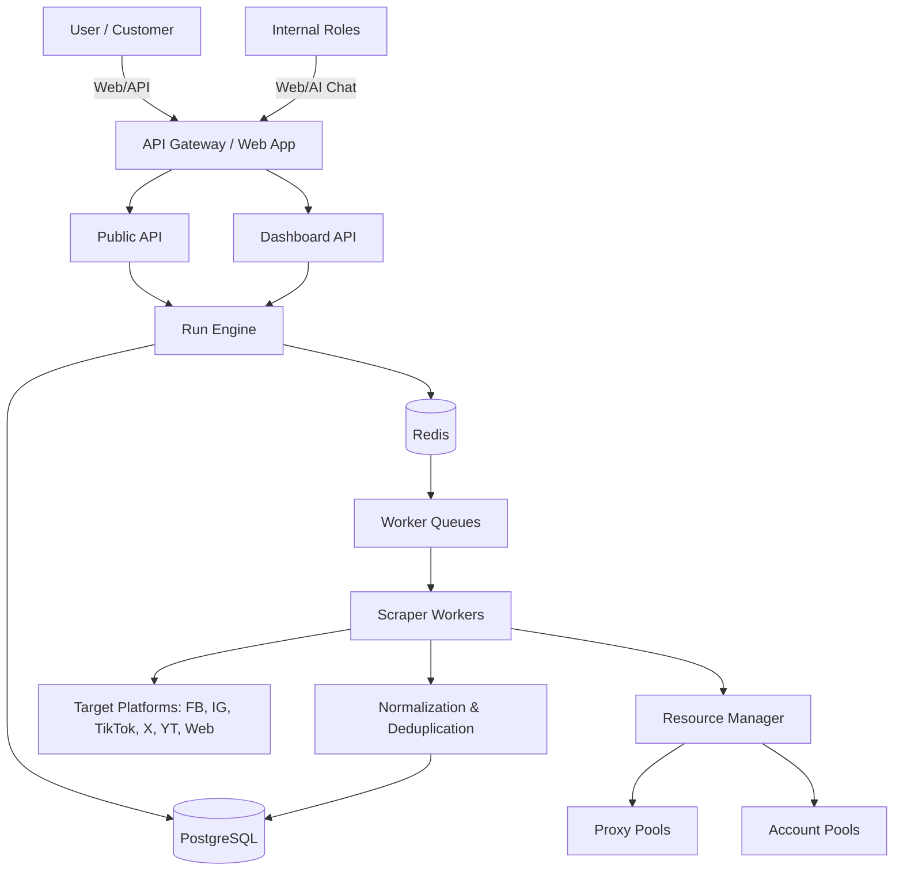
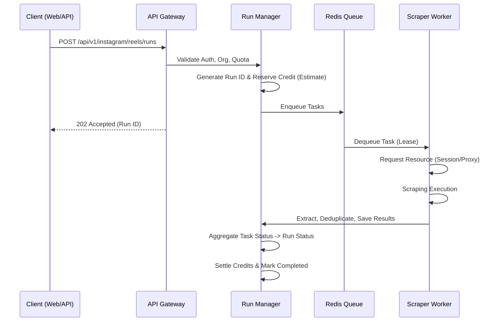
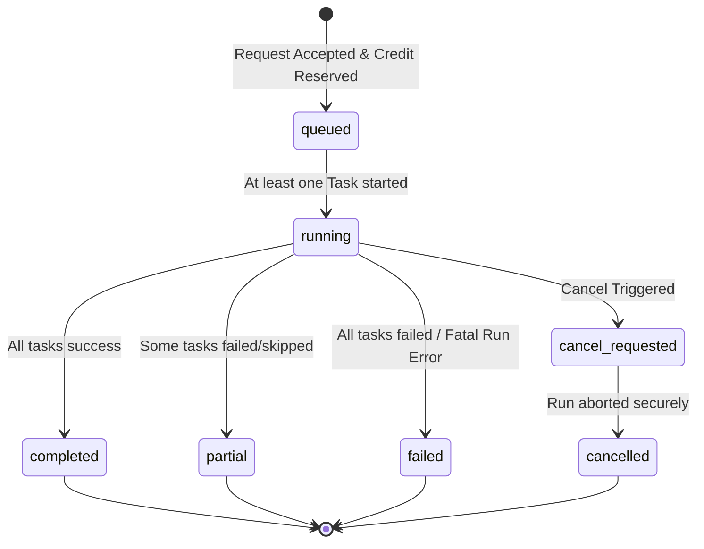
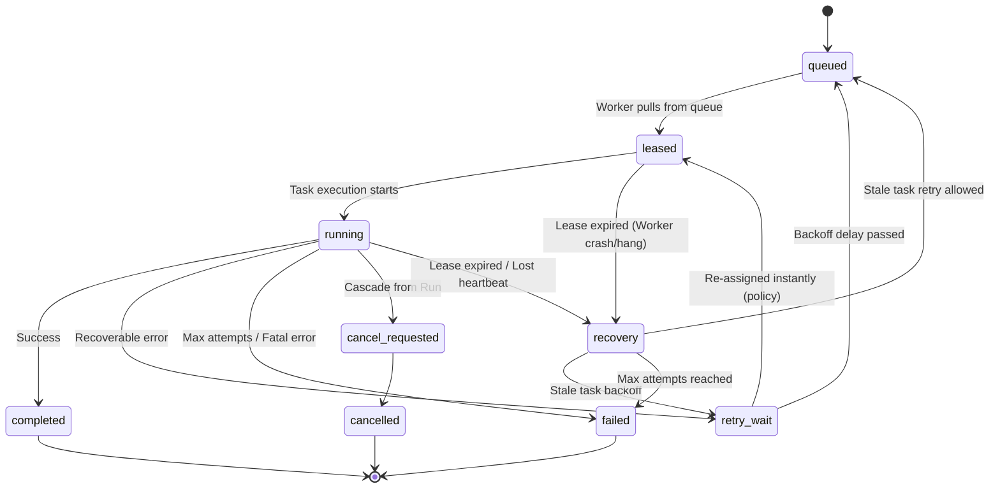
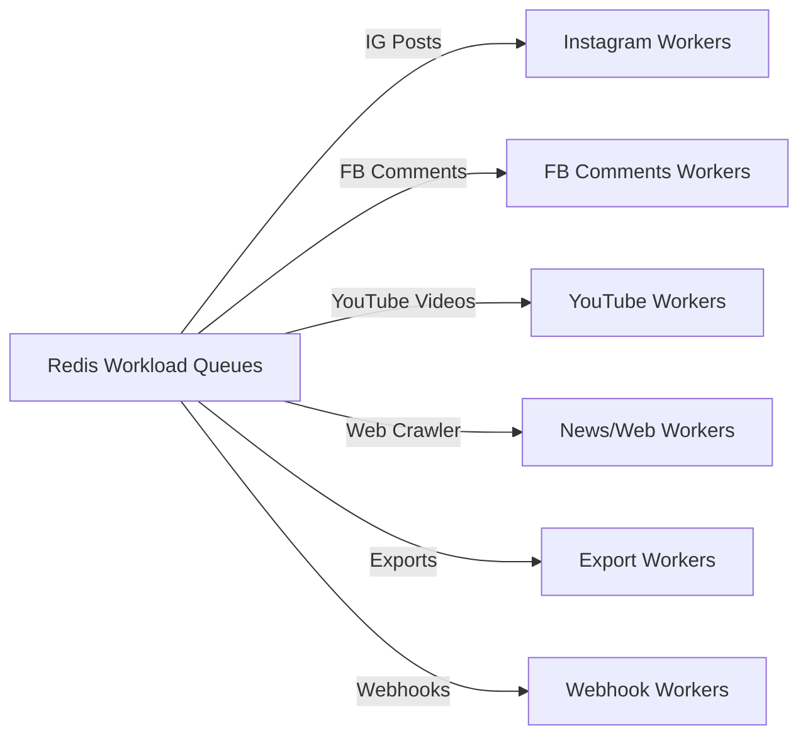
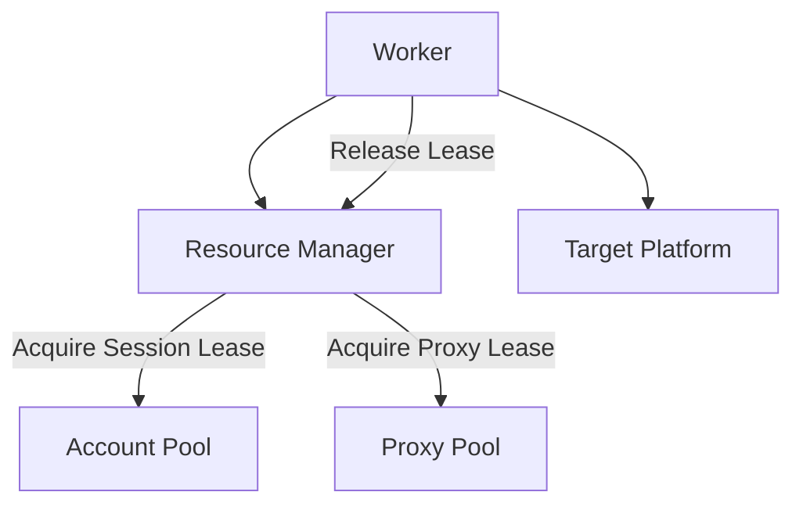
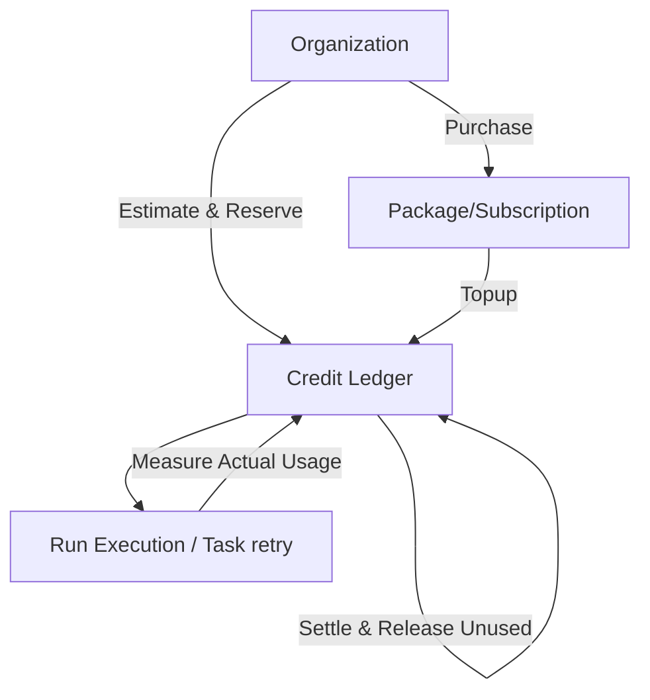
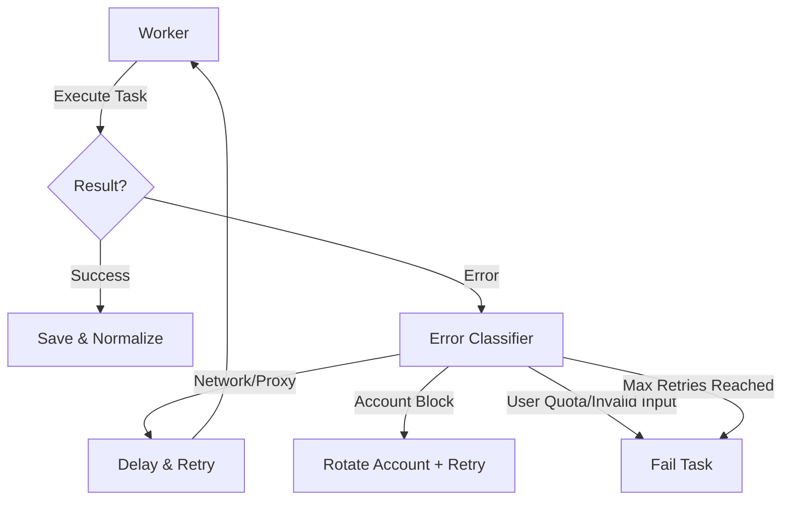
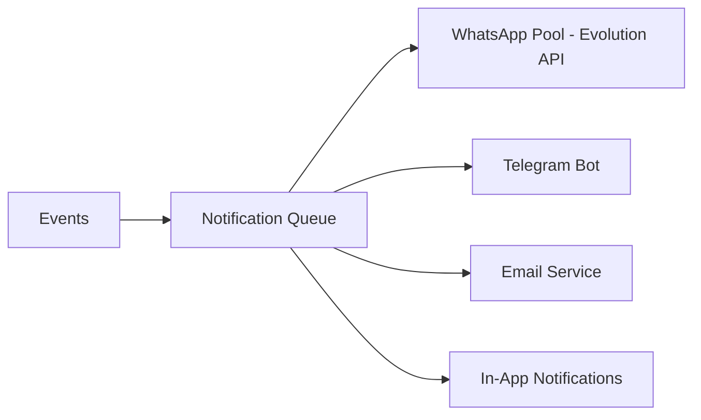
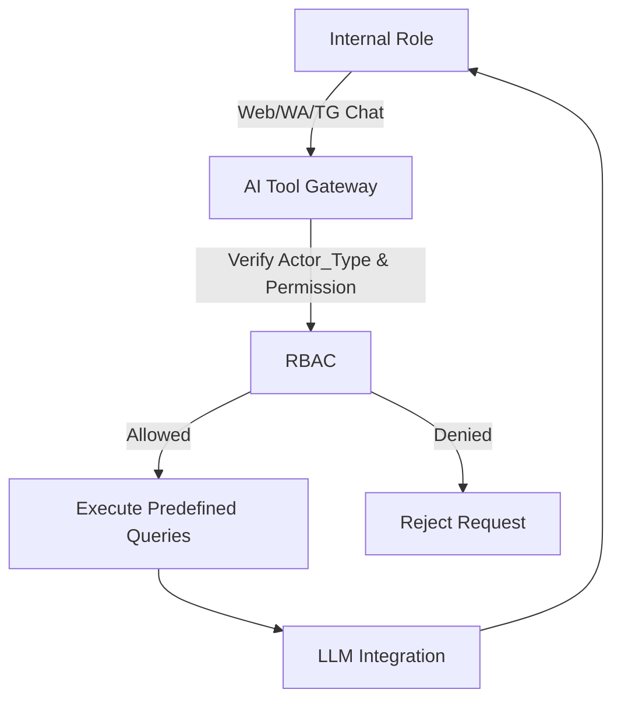

# System Architecture

## 1. System Context

Aplikasi Scraping & Data Collection as a Service memungkinkan User (via Dashboard atau API) untuk mengekstrak data dari berbagai platform sosial dan web. Sistem mengelola Run, Task, Worker, Proxy, dan Session secara internal.



## 2. High-Level Component Architecture

```mermaid
graph TD
    subgraph Client Layer
        WebUI[Dashboard UI]
        APIClient[API Clients]
    end

    subgraph App Layer
        WebApp[Web Application]
        PublicAPI[Public API]
        Auth[Authentication & RBAC]
        Billing[Billing & Credit Engine]
        AIGateway[AI Tool Gateway]
    end
    
    subgraph Core Engine
        RunManager[Run Manager]
        SearchIndex[Search Engine]
        Export[Export Engine]
        Notification[Notification Engine]
    end

    subgraph Worker Layer
        Queue[Redis Queues]
        WorkerCluster[Dedicated Worker Clusters]
    end
    
    subgraph Resource Layer
        ResManager[Resource Manager]
        ProxyPool[Proxy Pools]
        AccountPool[Account Pools]
    end
    
    subgraph Data Layer
        PG[(PostgreSQL - Source of Truth)]
        RedisCache[(Redis - Cache/Queue/Runtime)]
        S3[(Object Storage - Blob/Export)]
    end
    
    Client Layer --> App Layer
    App Layer --> Core Engine
    App Layer --> Auth
    Core Engine --> Queue
    Queue --> Worker Layer
    Worker Layer --> ResManager
    Worker Layer --> Data Layer
    App Layer --> Data Layer
    Core Engine --> Data Layer
```

## 3. Web Application, Public API & Scraping Request Flow

- **Web Application**: Melayani dashboard user dan admin. Menggunakan internal API pada Run Engine yang sama dengan Public API.
- **Public API**: Mengekspos endpoint spesifik per platform/jenis data (misal `/api/v1/instagram/reels/runs`). Memerlukan Bearer token (API Key).



## 4. Run Lifecycle

Run Lifecycle merepresentasikan status **bisnis** dari sebuah pekerjaan (kumpulan tasks). Status Run dihitung dan diagregasi dari status Task di bawahnya. Comment/replies ditarik menggunakan Run terpisah.



## 5. Task Lifecycle

Task Lifecycle merupakan lifecycle teknis (eksekusi terpisah dari Run). Eksekusi task bersifat idempotent.



**Mekanisme Task:**
- **Lease TTL**: Setiap task yang di-dequeue memiliki batas waktu sewa (Lease TTL) di Redis.
- **Heartbeat/Renewal**: Worker yang menjalankan long-running task mengirimkan heartbeat untuk memperbarui (renew) lease TTL.
- **Worker Crash & Stale Task Recovery**: Jika worker crash tanpa membebaskan task, lease TTL akan expired. Watchdog/reconciliation akan mendeteksi *stale task* dan melakukan pemulihan (`recovery` -> `queued`/`fail` sesuai jumlah attempt limit).
- **Max Attempts**: Jumlah maksimal retry/recovery sebelum task dinyatakan `failed`.
- **Idempotent Execution**: Pekerjaan dirancang sedemikian rupa agar jika task dire-execute karena crash, hasil (penyimpanan kanonikal/usage) tidak ganda.

## 6. Dedicated Workers & Queue Architecture

Workload, antrean (queue), dan konkurensi (concurrency) diisolasi dengan ketat per jenis task. Walaupun tidak selalu memerlukan mesin fisik terpisah, isolasi proses worker harus terjamin.

Daftar worker mandiri secara eksplisit:
1. Facebook Workers
2. Instagram Workers
3. TikTok Workers
4. YouTube Workers
5. X Workers
6. News/Web Workers
7. Comments/Replies Workers
8. Export Workers
9. Webhook Workers
10. WhatsApp Notification Workers
11. Telegram Notification Workers
12. Email Notification Workers
13. Search Index Workers
14. Maintenance/Reconciliation Workers



## 7. Resource Manager

Pemberian akun/sesi dan proxy ke worker dikelola oleh Resource Manager menggunakan sistem *Lease*. Sistem tidak menggunakan *busy-loop* ketika resource habis, melainkan menerapkan delay, backoff, atau controlled failure.

**Account Lease Properties:**
- `resource_id`: ID unik akun sosial / sesi.
- `owner_task`: ID Task yang sedang menyewa.
- `lease_ttl`: Batas waktu penyewaan (kedaluwarsa otomatis).
- `concurrency_slot`: Kapasitas maksimal penggunaan paralel per akun.
- `health/cooldown`: Status kesehatan akun (diblokir sementara, sehat, limit tercapai).
- `release`: Pengembalian sewa ke pool secara eksplisit setelah task selesai.
- `expired_lease_recovery`: Rekonsiliasi untuk merilis akun jika worker crash.

**Proxy Lease Properties:**
- Semua *properties* pada Account Lease.
- `sticky/affinity_policy`: Kemampuan mengikat (pin) IP tertentu ke task/akun untuk mencegah flag login mencurigakan.



## 8. Billing & Credit Lifecycle

Alur finansial/penggunaan kredit harus strictly idempotent dan terhindar dari double charge saat ada internal retry.

Lifecycle: `estimate` → `reserve` → `execute` → `measure actual usage` → `settle` → `release unused reserve`.

- **Completed Run**: Settlement menggunakan seluruh/sebagian reserve berdasarkan actual usage.
- **Partial Run**: Settlement memotong sebagian kredit, sisanya dikembalikan (release reserve).
- **Failed / Cancelled Run**: Reserve sepenuhnya di-release (dikembalikan) jika tidak ada data valid yang didapat akibat *internal error*.
- **Internal Retry / Duplicate Job**: Sistem rekonsiliasi memastikan task retry murni karena kendala teknis (proxy mati, worker crash) tidak menambah tagihan usage. Ledger bersifat **immutable**. 



## 9. Error Classification & Retry


Error dikelompokkan ke dalam kategori (Network, Account, Rate Limit, Invalid Input).
**Penting:** Worker/Retry engine tidak boleh melakukan retry task ke *scraper service* yang sedang berstatus Maintenance. Task tersebut akan ditahan (tunda sampai service eligible atau policy timeout tercapai).

## 10. Canonical Data & Tenant Boundary

- **Canonical Content**: Identitas data hasil scraping yang ternormalisasi (internal normalized identity). Disimpan secara global untuk menghindari duplikasi scraping ke target eksternal.
- **Organization Result / Run Lineage**: Batas otorisasi (authorization boundary). Pemetaan `run_results` menghubungkan Run milik Organisasi ke Canonical Content.
- **Aturan Batas (Boundary Rules)**: Semua *customer-facing read/API* wajib melewati Organization-owned Run/Result relationship. Deduplikasi canonical tidak pernah dan tidak boleh memberikan akses baca lintas tenant secara langsung. Tenant tidak memiliki akses langsung ke gudang Canonical Data global.

## 11. Maintenance Behavior

Jika sebuah scraper/platform masuk ke mode **Maintenance** dan Run baru diblokir:
- Tidak ada *execution task* yang dibuat.
- Tidak ada *credit reserve* yang dilakukan.
- Respons sistem secara transparan menjelaskan mode maintenance kepada user.

Untuk status yang sudah berjalan:
- **Queued Run**: Mengikuti policy spesifik (bisa ditahan di queue sampai maintenance selesai, atau dibatalkan dan direfund reserve-nya).
- **Running Run**: Secara default dibiarkan selesai hingga tuntas. Penghentian paksa (*emergency stop*) hanya dapat dilakukan melalui *controlled cancellation*.
- **Retry Tasks**: Ditahan dan tidak diteruskan ke service scraper yang maintenance hingga service eligible kembali atau batas timeout antrean habis.

## 12. Security Boundary

- **Credential & Secrets At Rest**: 
  - Kata sandi (password) di-*hash*.
  - API Keys di-*hash* (tidak dapat di-recover plaintext).
  - Account/session credentials, Proxy credentials, Evolution API credentials, dan Telegram bot credentials dienkripsi (*encrypted at rest*).
- **Payload & Logs**: Tidak boleh ada *secret* dalam *plaintext* di *payload* Redis maupun pada seluruh level *logs / failed jobs traces*.
- **Authorization**: Diperiksa selalu di sisi server (*server-side authorization*) dengan pendekatan *deny-by-default*.
- **Isolation**: Isolasi tenant ketat berbasis Organization (bukan individu/project). Akses *Service Account* menggunakan prinsip *least privilege*.

## 13. Observability Context

Setiap aliran (flow) penting, mutasi, atau pencatatan *log* harus menyertakan konteks identitas (traces) yang persisten:
- `request_id`
- `organization_id`
- `actor_id`
- `actor_type`
- `run_id` (bila relevan)
- `task_id` (bila relevan)
- `event_id` (bila relevan)

**Actor Type (minimal)**: `user`, `api_key`, `service_account`, `system`, `ai`.
*(Catatan pengingat: Log / Observability platform bebas sepenuhnya dari kebocoran secret plaintext).*

## 14. Graceful Degradation

Layanan didesain untuk gagal secara elegan tanpa mematikan core yang tidak terdampak:
- **Redis unavailable**: API terdegradasi (tidak bisa menerima antrean baru/Run baru), *workers* berhenti sejenak hingga pulih.
- **PostgreSQL unavailable**: Outage penuh (karena PostgreSQL adalah source of truth utama).
- **Object Storage unavailable**: File Export akan gagal, tugas akan di-*retry* atau ditahan. Layanan *scraping* inti tetap berjalan.
- **Search unavailable**: Layanan pencarian/filter terdegradasi, namun *scraping*, penyimpanan ke PostgreSQL, dan eksekusi Run terus berjalan. Search Indexing di-queue.
- **WhatsApp/Telegram unavailable**: Notifikasi antre di *queue* / di-*retry*. Eksekusi *scraping* tetap berjalan lancar.
- **AI Provider unavailable**: Fungsionalitas *AI Chat* internal tidak aktif. Layanan operasional scraping inti berjalan normal (AI bukan core dependency).
- **Single Scraper unavailable (contoh: IG berubah total)**: *Scraper* spesifik masuk ke error rate tinggi/maintenance, sementara *scraper* lainnya (TikTok, X, dll) tetap berjalan 100%.

## 15. Export Retention (Final Decision)

Penanganan *Generated Export File*:
- **CSV**: *Streaming/chunked* -> dikirim lewat *multipart upload* ke Object Storage.
- **XLSX**: Dieksekusi via *background worker* -> menggunakan *disk-backed/chunked generation* lokal di worker -> upload ke Object Storage.
- **PDF**: Difokuskan sebagai luaran orientasi laporan/dokumen (*report-oriented*) dengan batas jumlah *record* (baris) yang jauh lebih rendah.

**Generated Export File Retention Policy**:
- **Default Retention**: 14 hari.
- **Package Override**: 7 hari, 14 hari, 30 hari, 90 hari. Di-snapshot saat *export* dibuat.
- **Aturan Kadaluarsa (Expiry)**:
  - Tautan *download* kedaluwarsa.
  - File fisik dihapus secara *asynchronous* dari S3/Object Storage (harus *idempotent* dan *retryable* jika gagal bersih).
  - Ekspirasi ekspor *tidak menghapus* canonical scraping data.
  - Lifecycle `created_at`, `expires_at`, `expired_at`, `storage_deleted_at`, `status` (`expired`) dijaga dalam metadata terpisah dari Run Lineage.

## 16. Internal AI Operations Assistant & Notification

- **AI Tool Gateway**: AI tidak bisa query SQL langsung. AI hanya boleh memanggil fungsi *gateway* (`getSystemHealth()`, dll). Sifatnya *Read-only* di versi 1.
- AI bukan dependency scraping core.
- **Notifikasi**: Queue-based async delivery.





## 17. Architecture Lock Status

Dengan pemenuhan keseluruhan persyaratan PRD v1.4, integrasi *Task Lifecycle* yang independen dari Run, penjabaran *Graceful Degradation*, pemisahan *Tenant Boundary*, hingga *Security & Observability Context*, arsitektur ini secara resmi dikunci.

**Architecture Status**: LOCKED  
**PRD Baseline**: PRD_FINAL_v1.4.md  
**Remaining Product Decisions**: NONE  

## Application Stack (LOCKED)
- **Backend Framework**: Laravel
- **Application UI**: Blade + Livewire
- **Frontend Rule**: NO React, NO Vue, NO Inertia
- **Database**: PostgreSQL (Raw migrations are authoritative)
- **Cache / Queue**: Redis + Laravel Queue
- **Scheduler**: Laravel Scheduler
- **API**: Laravel API implementation following docs/openapi.yaml
- **Logging**: Laravel structured logging / Monolog
- **Password Hashing**: Laravel Hash (Argon2id)
- **Testing**: Pest or PHPUnit
- **Containerization**: Docker
